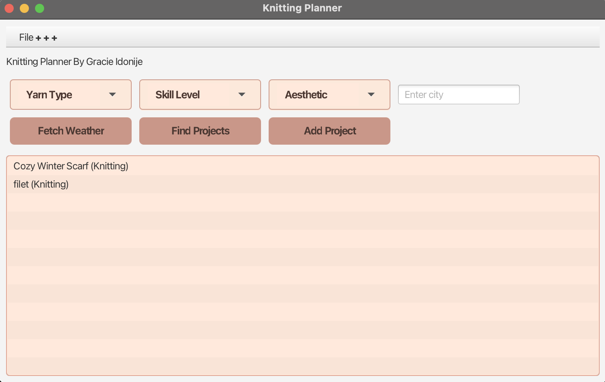
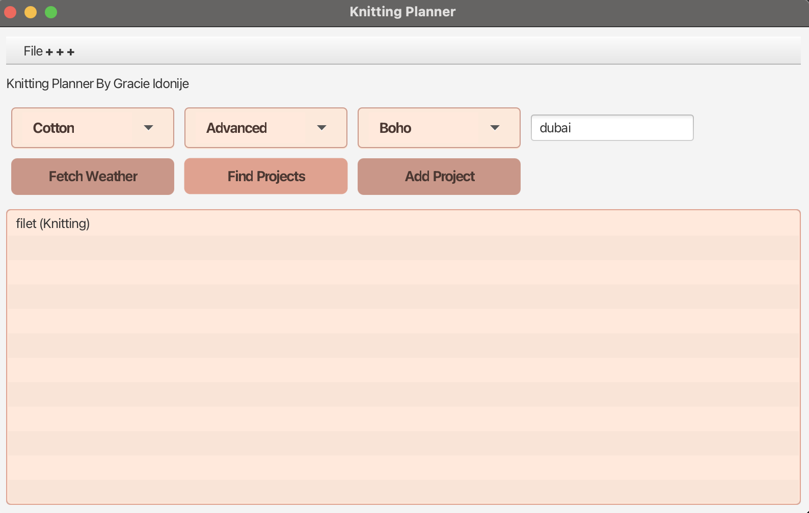
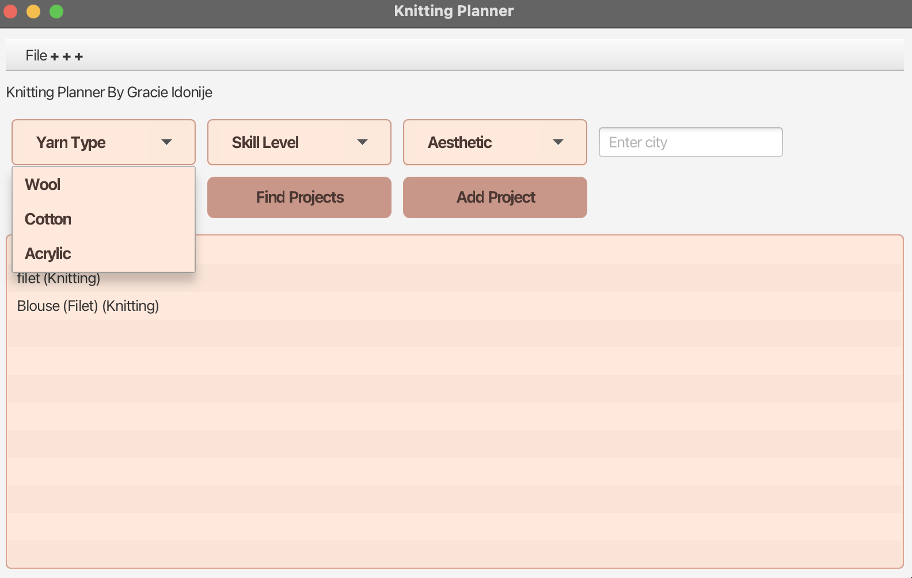
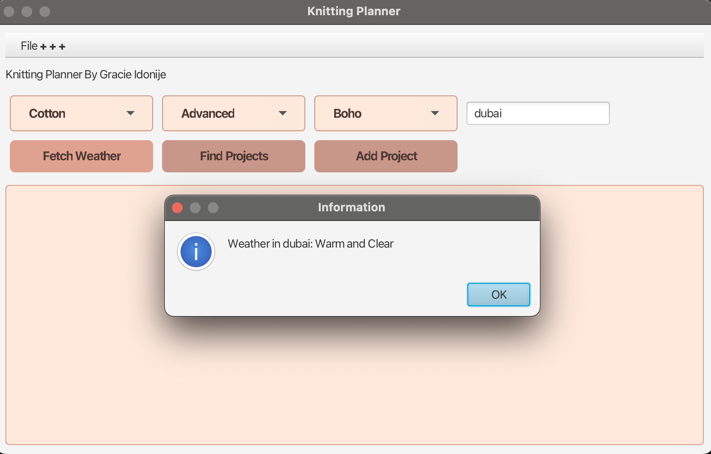
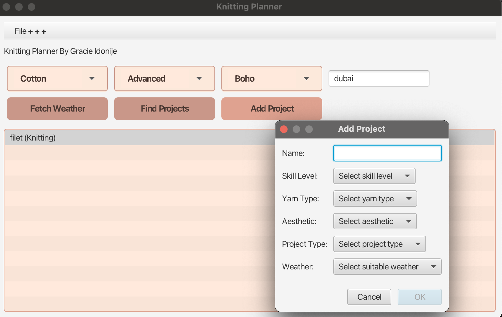
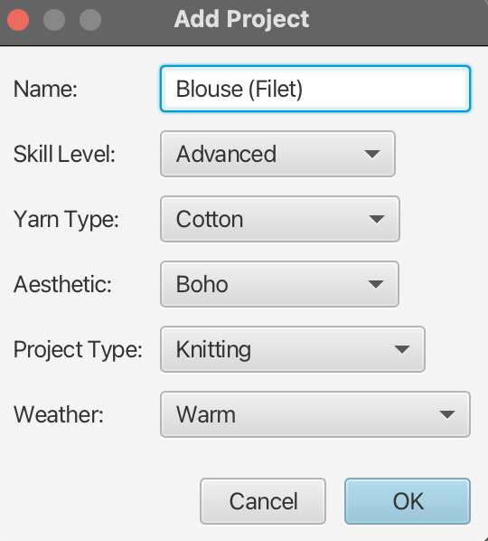

# What Should I Make?  
**DIY Suggestion App (In Progress & Personal)**  
Concordia University, Montreal, QC

---

## Overview  
“What Should I Make?” is an AI-powered desktop application designed to recommend knitting and crochet projects tailored to your local weather, skill level, available yarn, and personal aesthetic.  

Built using Java and JavaFX, this app aims to enhance the crafting experience by offering smart project suggestions with features for saving, editing, and filtering projects. While currently developed with JavaFX code, future updates plan to incorporate Scene Builder for improved UI design.  

---

## Features  
- Personalized project recommendations based on weather conditions and user preferences  
- Real-time weather fetching integration for context-aware suggestions  
- Skill level, yarn availability, and aesthetic filtering  
- Project creation, saving, and editing functionalities  
- Intuitive and responsive JavaFX-based desktop interface  

---

## Screenshots

### Main Window  
  
_The main interface of the “What Should I Make?” app, providing an overview of the DIY suggestion platform._

### Project Suggestion  
  
_Example of a recommended knitting project based on user preferences and weather data._

### Filter Options  
  
_User inputs for skill level, yarn availability, personal aesthetic, and weather filters to tailor project recommendations._

### Weather Fetching  
  
_App integration fetching real-time weather data to enhance project suggestions._

### Project Creation  
  
  
_Interface for saving new knitting or crochet projects with editable details._

---

## Technologies  
- Java  
- JavaFX  
- OpenWeatherMap API (for weather data)  
- Future: Scene Builder (planned for UI enhancements)  

---

## Status  
This app is currently under active development and is a personal project. Features and UI are being iteratively improved.

---

## How to Run  
1. Clone the repository  
2. Open the project in your Java IDE (e.g., IntelliJ IDEA, Eclipse)  
3. Run the main JavaFX application class  
4. (Optional) Configure your API key for weather data in the config file  

---

## Contact  
For questions or suggestions, feel free to reach out at idonijegracie@gmail.com 

---

*Thank you for checking out my project!*

